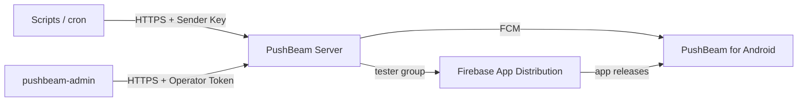

<p align="center">
  
</p>

<h1 align="center">PushBeam</h1>

<p align="center">
  A self-hosted push notification service that sends server alerts to the people you allow — and lets each of them receive only the alerts they want.
</p>

<p align="center">
  <a href="LICENSE"></a>
  <a href="https://github.com/zyautra/PushBeam/actions/workflows/ci.yml"></a>
</p>

<p align="center">
  <b>English</b> | <a href="README.ko.md">한국어</a>
</p>

---

## Features

- **One HTTP request to send** — scripts, cron jobs and monitoring tools post to a channel with `POST /api/v1/messages`.
- **Allowed people only** — an allowlist of Google account emails also drives app distribution (Firebase App Distribution).
- **Recipients choose** — channel subscriptions, mute, minimum severity that rings, quiet hours. Alerts that don't ring still land in the app's list.
- **Critical alerts always arrive** — `critical` alerts in required channels ring regardless of settings.
- **Everything is recorded** — see who received an alert, and why it didn't ring for someone.



## Components

| Directory | Description | Technology |
| --- | --- | --- |
| [`server/`](server/) | PushBeam Server | Kotlin, Ktor, SQLite, JVM 25 |
| [`android/`](android/) | PushBeam for Android | Kotlin, Jetpack Compose |
| [`admin-cli/`](admin-cli/) | Admin tool `pushbeam-admin` | Kotlin, Clikt |
| [`shared/`](shared/) | API types shared by server, app and tool | Kotlin, kotlinx.serialization |
| [`deploy/`](deploy/) | Docker Compose and Kubernetes configuration | |
| [`docs/`](docs/) | Design documents | |

## Getting started

### Prerequisites

- JDK 25 (Gradle downloads the JDKs it needs)
- Android SDK (to build the app)
- A Firebase project with Cloud Messaging, Authentication (Google) and App Distribution

### Build and test

```bash
cp android/google-services.example.json android/google-services.json   # replace with your Firebase config
./gradlew :shared:test :server:test :admin-cli:test :android:assembleDebug
```

### Run the server

```bash
# Locally (starts without Firebase)
PUSHBEAM_DATA_DIR=/tmp/pushbeam ./gradlew :server:run

# Docker Compose (with HTTPS)
cd deploy/compose && cp .env.example .env && docker compose up -d --build
```

For Kubernetes, see [`deploy/kubernetes/README.md`](deploy/kubernetes/README.md).

### Send an alert

```bash
curl -X POST https://pushbeam.example.com/api/v1/messages \
  -H "Authorization: Bearer pbs_..." \
  -H "Content-Type: application/json" \
  -H "User-Agent: my-monitor/1.0" \
  -d '{"target":{"channel":"server-alerts"},"title":"Disk warning","body":"/var at 92%","severity":"high"}'
```

### Operate

```bash
./gradlew :admin-cli:installDist
pushbeam-admin members allow friend@gmail.com
pushbeam-admin channels create server-alerts --name "Server alerts" --required
pushbeam-admin senders create nas-monitor --channels server-alerts
```

## Documentation

| Document | Contents |
| --- | --- |
| [00 Product Specification](docs/00_product-specification.md) | What the product does, delivery rules |
| [01 Architecture](docs/01_architecture.md) | Components and flows |
| [02 Data Model](docs/02_data-model.md) | Database tables |
| [03 API Specification](docs/03_api-specification.md) | HTTP API, FCM messages |
| [04 Security and Deployment](docs/04_security-and-deployment.md) | Authentication, secrets, deployment |
| [05 Operations](docs/05_operations.md) | Installation, `pushbeam-admin`, troubleshooting, releases |
| [06 Client UX](docs/06_client-ux.md) | Screens and wording |
| [07 Backlog](docs/07_backlog.md) | Ideas for later |

Korean versions are in [`docs/ko/`](docs/ko/).

## Releases

The version lives in one place: `pushbeam.version` in [`gradle.properties`](gradle.properties).
Pushing a `v<version>` tag makes GitHub Actions build, sign and distribute the app to the App Distribution tester group.
Changes are listed in the [CHANGELOG](CHANGELOG.md).

## Contributing

See [CONTRIBUTING](CONTRIBUTING.md). Report security issues as described in [SECURITY](SECURITY.md).

## License

[MIT](LICENSE)
