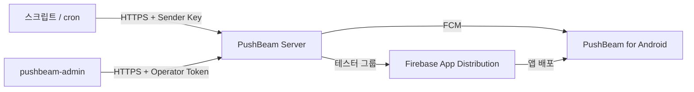

<p align="center">
  
</p>

<h1 align="center">PushBeam</h1>

<p align="center">
  운영자가 허용한 사람들에게 서버 알림을 보내고, 각자 원하는 알림만 받게 해 주는 개인용 푸시 알림 서비스
</p>

<p align="center">
  <a href="LICENSE"></a>
  <a href="https://github.com/zyautra/pushbeam/actions/workflows/ci.yml"></a>
</p>

---

## 특징

- **HTTP 한 번으로 발송** — 스크립트, cron, 모니터링 도구가 `POST /api/v1/messages`로 채널에 알림을 보낸다.
- **허용한 사람만** — Google 계정 이메일로 허용 목록을 관리하고, 앱 배포(Firebase App Distribution)도 같은 목록으로 맞춘다.
- **받는 사람이 고른다** — 채널 구독, 음소거, 울릴 최소 중요도, 방해 금지 시간. 울리지 않은 알림도 앱 목록에는 남는다.
- **긴급 알림은 반드시** — 필수 채널의 `critical` 알림은 어떤 설정에서도 울린다.
- **기록이 남는다** — 누구에게 보냈고, 왜 울리지 않았는지 서버에서 조회할 수 있다.



## 구성

| 디렉터리 | 설명 | 기술 |
| --- | --- | --- |
| [`server/`](server/) | PushBeam Server | Kotlin, Ktor, SQLite, JVM 25 |
| [`android/`](android/) | PushBeam for Android | Kotlin, Jetpack Compose |
| [`admin-cli/`](admin-cli/) | 운영 도구 `pushbeam-admin` | Kotlin, Clikt |
| [`shared/`](shared/) | 서버·앱·도구가 함께 쓰는 API 형식 | Kotlin, kotlinx.serialization |
| [`deploy/`](deploy/) | Docker Compose, Kubernetes 배포 구성 | |
| [`docs/`](docs/) | 설계 문서 | |

## 빠른 시작

### 준비물

- JDK 25 (Gradle이 필요한 JDK를 자동으로 받는다)
- Android SDK (앱을 빌드할 때)
- Firebase 프로젝트: Cloud Messaging, Authentication(Google), App Distribution

### 빌드와 테스트

```bash
cp android/google-services.example.json android/google-services.json   # 실제 Firebase 설정으로 교체
./gradlew :shared:test :server:test :admin-cli:test :android:assembleDebug
```

### 서버 실행

```bash
# 로컬 (Firebase 없이 뜬다)
PUSHBEAM_DATA_DIR=/tmp/pushbeam ./gradlew :server:run

# Docker Compose (HTTPS 포함)
cd deploy/compose && cp .env.example .env && docker compose up -d --build
```

Kubernetes 배포는 [`deploy/kubernetes/README.md`](deploy/kubernetes/README.md)를 본다.

### 알림 보내기

```bash
curl -X POST https://pushbeam.example.com/api/v1/messages \
  -H "Authorization: Bearer pbs_..." \
  -H "Content-Type: application/json" \
  -H "User-Agent: my-monitor/1.0" \
  -d '{"target":{"channel":"server-alerts"},"title":"디스크 경고","body":"/var 92%","severity":"high"}'
```

### 운영

```bash
./gradlew :admin-cli:installDist
pushbeam-admin members allow friend@gmail.com
pushbeam-admin channels create server-alerts --name "서버 경고" --required
pushbeam-admin senders create nas-monitor --channels server-alerts
```

## 문서

| 문서 | 내용 |
| --- | --- |
| [00 제품 사양서](docs/00_product-specification.md) | 무엇을 하는 제품인지, 수신 규칙 |
| [01 아키텍처](docs/01_architecture.md) | 구성, 발송 흐름 |
| [02 데이터 모델](docs/02_data-model.md) | DB 테이블 |
| [03 API](docs/03_api-specification.md) | HTTP API, FCM 메시지 |
| [04 보안과 배포](docs/04_security-and-deployment.md) | 인증, 비밀 값, 배포 |
| [05 운영](docs/05_operations.md) | 설치, `pushbeam-admin`, 문제 확인, 릴리즈 |
| [06 앱 화면](docs/06_client-ux.md) | 화면과 문구 |
| [07 Backlog](docs/07_backlog.md) | 나중에 검토할 기능 |

## 릴리즈

버전은 [`gradle.properties`](gradle.properties)의 `pushbeam.version` 하나로 관리한다.
`pushbeam-v<버전>` 태그를 push하면 GitHub Actions가 앱을 빌드·서명해 App Distribution 테스터 그룹에 배포한다.
변경 내역은 [CHANGELOG](CHANGELOG.md)에 남긴다.

## 기여

[CONTRIBUTING](CONTRIBUTING.md)을 본다. 보안 문제는 [SECURITY](SECURITY.md)의 방법으로 알려 준다.

## 라이선스

[MIT](LICENSE)
