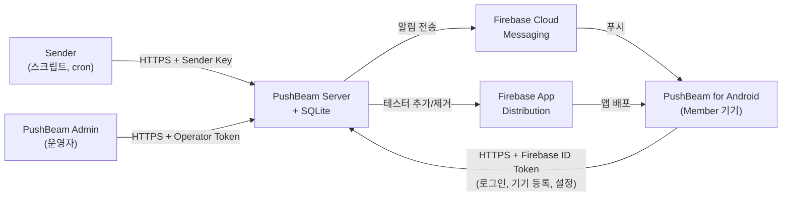
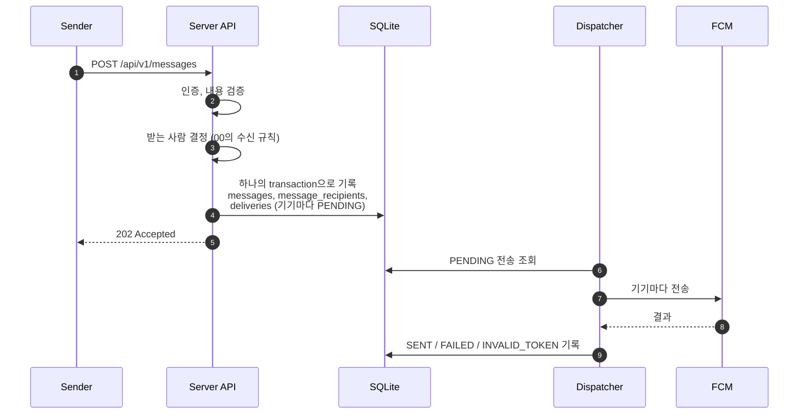
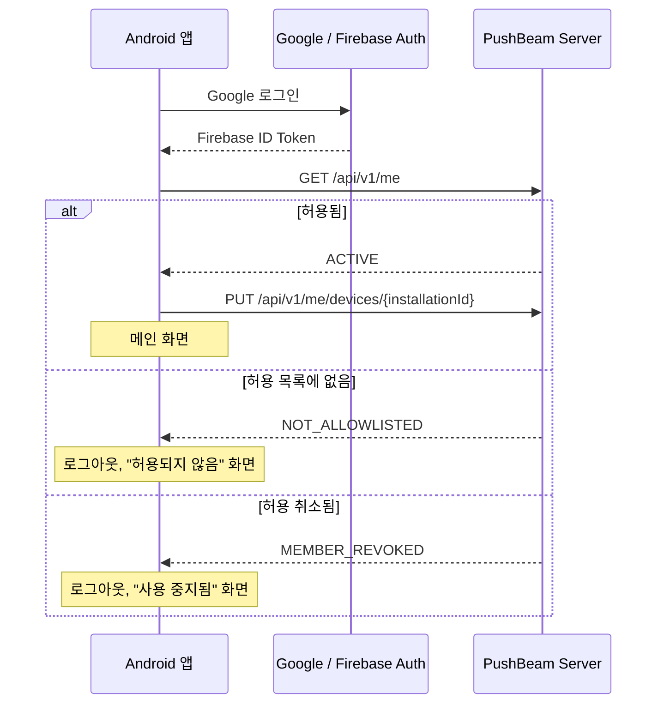
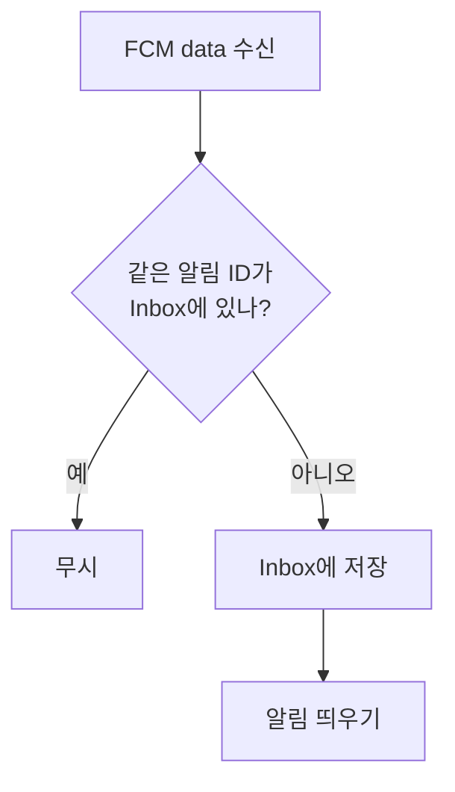

# Architecture

## 1. 문서 목적

이 문서는 PushBeam의 구성요소, 기술 스택, 저장소 구조, 그리고 알림이 보내지기까지의 흐름을 정의한다.

제품 요구사항은 [00 Product Specification](./00_product-specification.md), 데이터는 [02 Data Model](./02_data-model.md), API 형식은 [03 API Specification](./03_api-specification.md)을 따른다.

---

## 2. 전체 구성



모든 상태는 PushBeam Server의 SQLite 파일 하나에 있다. 앱은 받은 알림 목록만 따로 보관한다.

---

## 3. 기술 스택

모든 구성요소를 Kotlin으로 만든다. API 형식을 `shared` 모듈 하나에서 정의하고 서버, 앱, 관리 도구가 같이 쓰기 위해서다.

| 구성요소       | 기술                                                            |
| -------------- | --------------------------------------------------------------- |
| Server         | Kotlin, JVM 25 (LTS), Ktor, kotlinx.serialization, SQLite (JDBC), Firebase Admin SDK |
| Android        | Kotlin, Jetpack Compose, Firebase Auth·Messaging, Room, DataStore, WorkManager, Ktor Client |
| Admin          | Kotlin, JVM 25 (LTS), Clikt, Ktor Client                              |
| Shared         | Kotlin, kotlinx.serialization                                   |
| 배포           | Docker Compose, Caddy (HTTPS)                                   |
| CI             | GitHub Actions                                                  |

Server와 Admin은 최신 LTS인 Java 25에서 실행한다. Android 앱 빌드는 Android Gradle Plugin이 지원하는 JDK를 쓴다.

---

## 4. 저장소 구조

하나의 Git 저장소, 하나의 Gradle build로 구성한다.

```text
pushbeam/
├── settings.gradle.kts
├── gradle/libs.versions.toml
├── shared/       API 요청·응답 타입, 열거형, FCM data key
├── server/       PushBeam Server
├── admin-cli/    PushBeam Admin
├── android/      PushBeam for Android
├── deploy/       docker-compose.yml, Caddyfile
├── docs/
└── .github/workflows/
```

`server`, `admin-cli`, `android`는 `shared`에만 의존하고 서로 의존하지 않는다.

---

## 5. Server

### 5.1 구성요소

| 구성요소           | 하는 일                                                   |
| ------------------ | --------------------------------------------------------- |
| API (Ktor)         | 인증, 요청 검증, 각 서비스 호출                           |
| MemberService      | 허용·취소, 첫 로그인 처리, 기기 등록                      |
| ChannelService     | 채널 관리, 구독·음소거·최소 중요도 변경                   |
| MessageService     | 알림 받기, 받는 사람 결정, 기록                           |
| Dispatcher         | 대기 중인 전송을 FCM으로 보내고 결과 기록, 재시도         |
| DistributionSync   | 허용 목록을 App Distribution 그룹에 반영                  |
| Housekeeping       | 90일 지난 기록 삭제, 하루 한 번 DB 백업                   |

FCM과 App Distribution 호출은 interface 뒤에 두어 테스트에서 가짜로 바꿀 수 있게 한다.

### 5.2 알림을 보내는 흐름



4번이 끝나야 응답한다. 서버가 그 뒤에 꺼져도 다시 켜지면 Dispatcher가 남은 PENDING을 이어서 보낸다.

받는 사람은 3번에서 한 번 정한다. 그 뒤 Member가 설정을 바꿔도 이미 받은 알림의 기록은 바뀌지 않는다.

### 5.3 FCM 결과 처리

| FCM 결과                                    | 처리                                                    |
| ------------------------------------------- | ------------------------------------------------------- |
| 성공                                        | `SENT`                                                  |
| `UNREGISTERED`, `SENDER_ID_MISMATCH`        | `INVALID_TOKEN`, 기기를 비활성화                        |
| `UNAVAILABLE`, `INTERNAL`, 할당량 초과, 네트워크 오류 | 재시도 (15초 → 1분 → 5분 → 15분), 그래도 실패하면 `FAILED` |
| 그 외                                       | `FAILED`                                                |

받은 지 24시간이 지나도 보내지 못한 전송은 `FAILED`로 끝낸다. 오래된 경보가 뒤늦게 가지 않게 하기 위해서다.

재시도 시각은 DB에 기록한다. 서버가 재시작되어도 그대로 이어진다.

### 5.4 중복 전송

FCM 전송이 성공한 직후 결과를 기록하기 전에 서버가 꺼지면, 재시작 후 같은 알림을 한 번 더 보낼 수 있다.

앱은 알림 ID로 중복을 걸러 한 번만 표시한다.

### 5.5 허용 취소

취소하면 하나의 transaction으로 다음을 처리한다.

- Member 상태를 `REVOKED`로 바꾼다.
- 그 사람의 기기를 모두 비활성화한다.
- 아직 보내지 않은 전송을 `CANCELLED`로 바꾼다.
- 구독을 모두 지운다.

Dispatcher는 보내기 직전에 Member와 기기가 활성 상태인지 다시 확인한다.

### 5.6 App Distribution 동기화

- 허용하면 테스터 그룹 `pushbeam-members`에 추가하고, 취소하면 그룹에서 뺀다.
- 실패해도 허용·취소 자체는 그대로 유효하다. 로그인과 알림은 허용 목록만 본다.
- 서버 시작 시와 6시간마다 그룹 전체를 허용 목록과 비교해 맞춘다. 실패했던 반영은 이때 고쳐진다.

### 5.7 SQLite와 단일 서버

서버는 하나만 실행한다. 쓰기는 하나의 thread에서 순서대로 처리한다. FCM 같은 외부 호출은 DB transaction 밖에서 한다.

---

## 6. Android 앱

### 6.1 구성요소

| 구성요소                   | 하는 일                                         |
| -------------------------- | ----------------------------------------------- |
| 로그인                     | Credential Manager로 Google 로그인, Firebase Auth |
| ApiClient                  | Server 호출, ID Token 첨부                       |
| MessagingService           | FCM 수신, 토큰 변경 감지                         |
| Inbox (Room)               | 받은 알림 저장, 읽음, 걸러 보기                  |
| RegistrationWorker         | 기기 등록, 실패 시 재시도 (WorkManager)          |
| NotificationPresenter      | 중요도별 알림 채널, 알림 표시                    |

Server 주소는 빌드 설정에 넣는다. 사용자가 입력하지 않는다.

### 6.2 로그인



허용된 사람의 첫 요청에서 서버가 `INVITED`를 `ACTIVE`로 바꾸고 필수·자동 구독을 만든다.

### 6.3 기기 등록

- 앱은 처음 실행할 때 Installation ID(UUID)를 만들어 저장한다.
- 로그인했을 때, FCM 토큰이 바뀌었을 때, 앱이 업데이트되었을 때 `PUT /api/v1/me/devices/{installationId}`로 등록한다.
- 실패하면 WorkManager가 재시도한다.
- 로그아웃하면 기기 등록을 해제하고 FCM 토큰을 지운다.

### 6.4 알림 수신



저장한 뒤에 띄운다. 알림은 떴는데 앱 목록에 없는 상황을 막기 위해서다.

| 조건          | Android 알림 채널 | 소리       |
| ------------- | ----------------- | ---------- |
| `critical`    | 긴급              | 소리·진동  |
| 무음 표시     | 조용히            | 없음       |
| `high`        | 높음              | 소리·진동  |
| `normal`      | 보통              | 소리       |
| `low`         | 낮음              | 없음       |

### 6.5 설정 변경

구독, 음소거, 최소 중요도, 방해 금지 시간은 서버에 요청하고, 성공 응답을 받은 뒤에 화면에 반영한다. 실패하면 이전 값으로 되돌린다.
