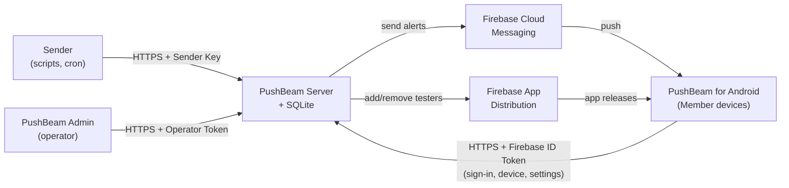
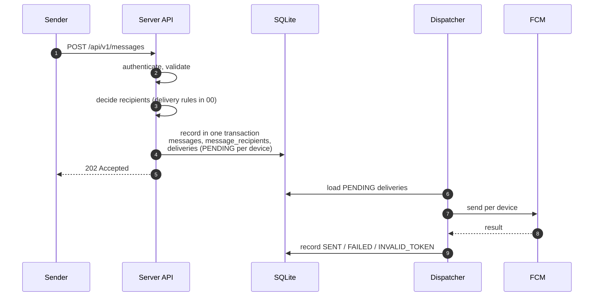
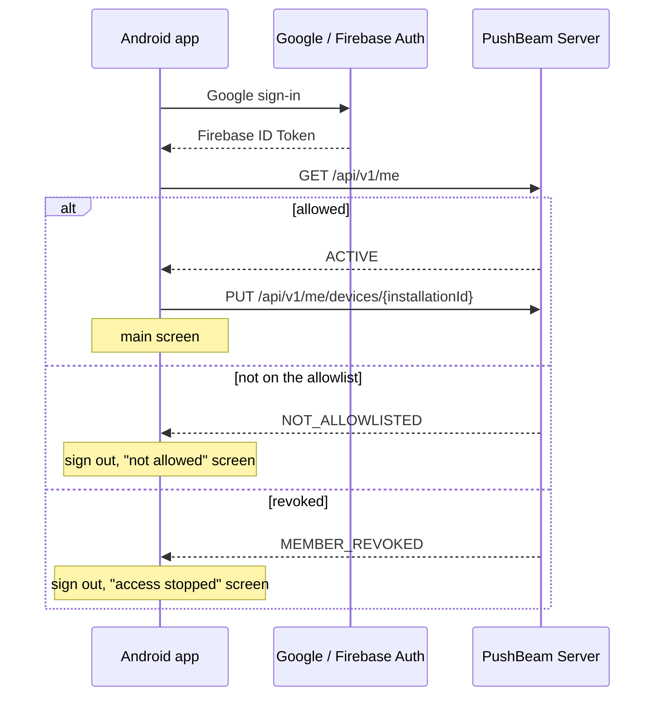
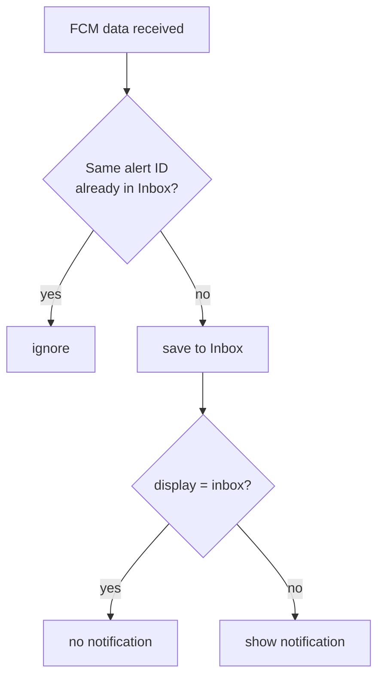

**English** | [한국어](ko/01_architecture.md)

# Architecture

## 1. Purpose

This document defines PushBeam's components, tech stack, repository layout, and how an alert flows to devices.

Product requirements follow [00 Product Specification](./00_product-specification.md), data follows [02 Data Model](./02_data-model.md), and API formats follow [03 API Specification](./03_api-specification.md).

---

## 2. Overview



All state lives in a single SQLite file on PushBeam Server. The app only keeps its own list of received alerts.

---

## 3. Tech stack

Every component is written in Kotlin, so the API format is defined once in the `shared` module and used by the server, the app and the admin tool.

| Component      | Technology                                                      |
| -------------- | --------------------------------------------------------------- |
| Server         | Kotlin, JVM 25 (LTS), Ktor, kotlinx.serialization, SQLite (JDBC), Firebase Admin SDK |
| Android        | Kotlin, Jetpack Compose, Firebase Auth/Messaging, Room, DataStore, WorkManager, Ktor Client |
| Admin          | Kotlin, JVM 25 (LTS), Clikt, Ktor Client                        |
| Shared         | Kotlin, kotlinx.serialization                                   |
| Deployment     | Docker Compose + Caddy (HTTPS), Kubernetes                      |
| CI             | GitHub Actions                                                  |

The server and admin tool run on Java 25, the latest LTS. The Android build uses a JDK supported by the Android Gradle Plugin.

---

## 4. Repository layout

One Git repository, one Gradle build.

```text
PushBeam/
├── settings.gradle.kts
├── gradle/libs.versions.toml
├── shared/       API request/response types, enums, FCM data keys
├── server/       PushBeam Server
├── admin-cli/    PushBeam Admin
├── android/      PushBeam for Android
├── deploy/       Docker Compose, Kubernetes
├── docs/
└── .github/
```

`server`, `admin-cli` and `android` depend only on `shared`, never on each other.

---

## 5. Server

### 5.1 Components

| Component          | Responsibility                                            |
| ------------------ | --------------------------------------------------------- |
| API (Ktor)         | Authentication, request validation, calling services      |
| MemberService      | Allow/revoke, first sign-in, device registration          |
| ChannelService     | Channel management, subscribe/mute/minimum severity       |
| MessageService     | Accept alerts, decide recipients, record                  |
| Dispatcher         | Send pending deliveries via FCM, record results, retry    |
| DistributionSync   | Mirror the allowlist into the App Distribution group      |
| Housekeeping       | Delete records older than 90 days, back up the DB daily   |

FCM and App Distribution calls sit behind interfaces so tests can replace them with fakes.

### 5.2 Sending an alert



The server responds only after step 4. If it stops afterwards, the Dispatcher resumes the remaining PENDING deliveries on restart.

Recipients are decided once, in step 3. Later setting changes do not alter the record of an alert already accepted.

### 5.3 Handling FCM results

| FCM result                                  | Handling                                                |
| ------------------------------------------- | ------------------------------------------------------- |
| Success                                     | `SENT`                                                  |
| `UNREGISTERED`, `SENDER_ID_MISMATCH`        | `INVALID_TOKEN`, deactivate the device                  |
| `UNAVAILABLE`, `INTERNAL`, quota exceeded, network error | Retry (15 s → 1 min → 5 min → 15 min), then `FAILED` |
| Anything else                               | `FAILED`                                                |

Deliveries not sent within 24 hours of acceptance end as `FAILED`, so stale alerts are never delivered late.

Retry times are stored in the database and survive restarts.

### 5.4 Duplicate delivery

If the server stops right after a successful FCM send but before recording the result, the same alert may be sent again after restart.

The app de-duplicates by alert ID and shows it once.

### 5.5 Revoking access

Revoking does the following in one transaction:

- Set the Member state to `REVOKED`.
- Deactivate all of their devices.
- Mark pending deliveries as `CANCELLED`.
- Delete all of their subscriptions.

The Dispatcher re-checks that the Member and device are active right before sending.

### 5.6 App Distribution sync

- Allowing adds the person to the tester group `pushbeam-members`; revoking removes them.
- If the sync fails, the allow/revoke itself still stands. Sign-in and delivery only look at the allowlist.
- On startup and every 6 hours, the whole group is reconciled against the allowlist, which repairs earlier failures.

### 5.7 SQLite and a single server

Only one server runs. Writes are serialized on a single thread. External calls such as FCM happen outside database transactions.

---

## 6. Android app

### 6.1 Components

| Component                  | Responsibility                                  |
| -------------------------- | ----------------------------------------------- |
| Sign-in                    | Google sign-in via Credential Manager, Firebase Auth |
| ApiClient                  | Server calls with the ID token attached         |
| MessagingService           | Receive FCM, detect token changes               |
| Inbox (Room)               | Store received alerts, read state, filtering    |
| RegistrationWorker         | Register the device, retry on failure (WorkManager) |
| NotificationPresenter      | Per-severity notification channels, show notifications |

The server address is set at build time; users never enter it.

### 6.2 Sign-in



On an allowed person's first request, the server changes `INVITED` to `ACTIVE` and creates required and auto-subscribe subscriptions.

### 6.3 Device registration

- The app creates and stores an installation ID (UUID) on first launch.
- It registers with `PUT /api/v1/me/devices/{installationId}` after sign-in, when the FCM token changes, and after an app update.
- WorkManager retries on failure.
- Signing out unregisters the device and deletes the FCM token.

### 6.4 Receiving alerts



The alert is saved before the notification is shown, so a notification never exists without its list entry.

| Condition         | Android notification channel | Sound            |
| ----------------- | ---------------------------- | ---------------- |
| `critical`        | Critical                     | Sound, vibration |
| Quiet hours       | Quiet                        | None             |
| `high`            | High                         | Sound, vibration |
| `normal`          | Normal                       | Sound            |
| `low`             | Low                          | None             |

The vibration and sound switches in Settings pick alternative channels (vibrate only, sound only, silent). They never apply to `critical`.

### 6.5 Changing settings

Subscriptions, mute, minimum severity and quiet hours are sent to the server and shown only after a successful response. On failure the previous value is restored.
