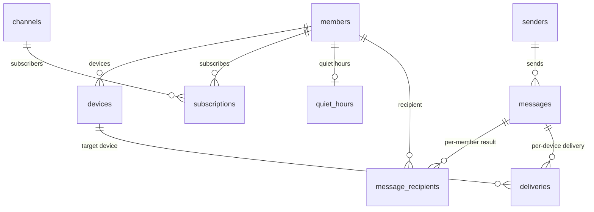

**English** | [한국어](ko/02_data-model.md)

# Data Model

## 1. Purpose

This document defines the PushBeam Server database tables and the Android app's local storage.

---

## 2. Basics

- The database is a single SQLite file: `/data/pushbeam.db`
- Schema changes are made only with numbered SQL files in `server/src/main/resources/db/migration/` (`V1__init.sql`, `V2__…`). On startup the server applies files it has not applied yet, in order, and records them in `schema_version`. Applied files are never edited.
- Times are stored as UTC epoch milliseconds.
- IDs are a prefix plus a ULID: `mbr_`, `dev_`, `snd_`, `msg_`, `dlv_`
- Emails are stored in lower case.
- Severity is ordered `CRITICAL > HIGH > NORMAL > LOW`.

---

## 3. Relationships



---

## 4. Configuration tables

### 4.1 members

```sql
CREATE TABLE members (
  id            TEXT PRIMARY KEY,
  email         TEXT NOT NULL UNIQUE,
  display_name  TEXT,
  status        TEXT NOT NULL,          -- INVITED, ACTIVE, REVOKED
  time_zone     TEXT,                   -- time zone of the last registered device
  allowed_at    INTEGER NOT NULL,
  activated_at  INTEGER,
  revoked_at    INTEGER,
  last_seen_at  INTEGER
);
```

### 4.2 devices

```sql
CREATE TABLE devices (
  id               TEXT PRIMARY KEY,
  member_id        TEXT NOT NULL REFERENCES members(id),
  installation_id  TEXT NOT NULL UNIQUE,
  fcm_token        TEXT NOT NULL,
  active           INTEGER NOT NULL,     -- 1 = receives deliveries
  model            TEXT,
  app_version      INTEGER,
  registered_at    INTEGER NOT NULL,
  last_seen_at     INTEGER NOT NULL
);

CREATE UNIQUE INDEX devices_active_token ON devices(fcm_token) WHERE active = 1;
```

- Registering again with the same installation ID updates the token and activates the device.
- If another Member registers the same installation ID, the device changes owner.
- If another device has the same FCM token, that device is deactivated.
- A device is deactivated when FCM reports an invalid token, on sign-out, and when the Member is revoked.

### 4.3 channels

```sql
CREATE TABLE channels (
  slug            TEXT PRIMARY KEY,     -- ^[a-z0-9-]{3,40}$
  name            TEXT NOT NULL,
  description     TEXT,
  required        INTEGER NOT NULL,
  auto_subscribe  INTEGER NOT NULL,
  created_at      INTEGER NOT NULL,
  archived_at     INTEGER              -- archived channels are hidden and cannot receive alerts
);
```

Channels are archived, never deleted. A slug cannot be changed.

### 4.4 subscriptions

```sql
CREATE TABLE subscriptions (
  member_id     TEXT NOT NULL REFERENCES members(id),
  channel       TEXT NOT NULL REFERENCES channels(slug),
  min_severity  TEXT NOT NULL DEFAULT 'LOW',
  muted         INTEGER NOT NULL DEFAULT 0,
  muted_until   INTEGER,                -- with muted = 1, NULL means until turned off
  created_at    INTEGER NOT NULL,
  PRIMARY KEY (member_id, channel)
);
```

Muted means: `muted = 1` and (`muted_until` is NULL or in the future).

Subscriptions are created:

- When a Member signs in for the first time: required and auto-subscribe channels
- When a required channel is created or a channel becomes required: every `ACTIVE` Member
- When a Member subscribes
- When the operator subscribes a Member

### 4.5 quiet_hours

```sql
CREATE TABLE quiet_hours (
  member_id  TEXT PRIMARY KEY REFERENCES members(id),
  enabled    INTEGER NOT NULL,
  start_min  INTEGER NOT NULL,          -- minutes after midnight (0–1439)
  end_min    INTEGER NOT NULL
);
```

`start_min > end_min` means the range crosses midnight. Equal values mean quiet hours are off.

### 4.6 senders

```sql
CREATE TABLE senders (
  id                TEXT PRIMARY KEY,
  name              TEXT NOT NULL UNIQUE,
  key_hash          TEXT NOT NULL UNIQUE,   -- SHA-256 of the Sender Key
  allowed_channels  TEXT NOT NULL,          -- JSON array
  created_at        INTEGER NOT NULL,
  last_used_at      INTEGER,
  revoked_at        INTEGER
);
```

---

## 5. Record tables

### 5.1 messages

```sql
CREATE TABLE messages (
  id              TEXT PRIMARY KEY,
  sender_id       TEXT REFERENCES senders(id),   -- NULL = operator
  target_type     TEXT NOT NULL,                 -- CHANNEL, USERS, ALL
  target_channel  TEXT,
  target_emails   TEXT,                          -- JSON array for USERS
  title           TEXT NOT NULL,
  body            TEXT NOT NULL,
  severity        TEXT NOT NULL,
  data            TEXT,                          -- JSON object
  created_at      INTEGER NOT NULL
);
```

### 5.2 message_recipients

Records, per Member, whether an alert was sent and, if not, why.

```sql
CREATE TABLE message_recipients (
  message_id  TEXT NOT NULL REFERENCES messages(id) ON DELETE CASCADE,
  member_id   TEXT NOT NULL REFERENCES members(id),
  result      TEXT NOT NULL,
  PRIMARY KEY (message_id, member_id)
);
```

| result       | Meaning                                          |
| ------------ | ------------------------------------------------ |
| `DELIVER`    | Sent                                             |
| `QUIET`      | Sent silently (quiet hours)                      |
| `MUTED`      | Sent to the list only, no notification (muted)   |
| `BELOW_MIN`  | Sent to the list only, no notification (below minimum severity) |
| `NOT_ACTIVE` | Has not signed in yet                            |
| `NO_DEVICE`  | No active device                                 |

For channel alerts, Members who are not subscribed are not recorded.

### 5.3 deliveries

One FCM send per device.

```sql
CREATE TABLE deliveries (
  id               TEXT PRIMARY KEY,
  message_id       TEXT NOT NULL REFERENCES messages(id) ON DELETE CASCADE,
  device_id        TEXT NOT NULL REFERENCES devices(id),
  quiet            INTEGER NOT NULL,     -- same as display = QUIET (V1 compatibility)
  display          TEXT NOT NULL,        -- NORMAL (notify), QUIET (silent), INBOX (list only)
  reason           TEXT,                 -- why INBOX: muted, below_min
  status           TEXT NOT NULL,        -- PENDING, SENT, FAILED, INVALID_TOKEN, CANCELLED
  attempts         INTEGER NOT NULL DEFAULT 0,
  next_attempt_at  INTEGER,
  last_error       TEXT,
  updated_at       INTEGER NOT NULL
);

CREATE INDEX deliveries_pending ON deliveries(next_attempt_at) WHERE status = 'PENDING';
```

---

## 6. Retention

| Data                                     | Kept                            |
| ---------------------------------------- | ------------------------------- |
| messages, message_recipients, deliveries | 90 days                         |
| members, channels, senders, devices      | Never deleted (kept as revoked/archived/inactive) |

---

## 7. Android local storage

### 7.1 Inbox (Room)

```sql
CREATE TABLE inbox (
  message_id   TEXT PRIMARY KEY NOT NULL,
  title        TEXT NOT NULL,
  body         TEXT NOT NULL,
  severity     TEXT NOT NULL,
  channel      TEXT,
  quiet        INTEGER NOT NULL,
  display      TEXT NOT NULL,   -- normal, quiet, inbox
  reason       TEXT,
  data         TEXT,
  sent_at      INTEGER NOT NULL,
  received_at  INTEGER NOT NULL,
  read_at      INTEGER
);
```

Alerts are stored with `INSERT OR IGNORE`, and a notification is shown only when a new row was inserted and `display` is not `inbox`. This is the de-duplication.

Entries older than 90 days are deleted. Signing in with a different account clears the inbox.

### 7.2 DataStore

| Value                 | Purpose                                 |
| --------------------- | --------------------------------------- |
| `installationId`      | Device identifier                       |
| `needsRegistration`   | Whether the device must register again  |
| `lastRegisteredAt`    | Last registration time                  |
| `lastAppVersion`      | Detect app updates                      |
| `sound`, `vibrate`    | Notification switches in Settings       |
| Channel/settings cache | Shown while offline                    |

App storage is excluded from Android auto backup.
