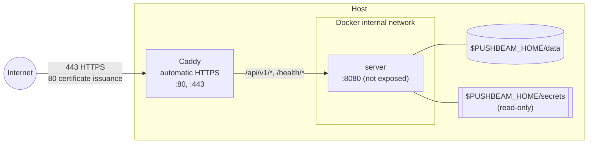

**English** | [한국어](ko/04_security-and-deployment.md)

# Security and Deployment

## 1. Purpose

This document defines how PushBeam is deployed, how requests are authenticated, and how secrets are handled.

---

## 2. Deployment

Whatever the setup, these rules apply:

- The server sits behind HTTPS. Port 8080 is never exposed directly.
- Only `/api/v1/*` is public. `/health/*` is for internal checks.
- Only one server runs (one SQLite file).
- The data directory is on a local disk. Network filesystems such as NFS are not used for SQLite.
- The server runs as a non-root user.
- The server needs outbound HTTPS to FCM and Firebase APIs.
- The app uses HTTPS only.

The repository only contains configuration anyone can use. Domains, Firebase projects, secrets and cluster settings live in git-ignored files (`deploy/compose/.env`, `deploy/kubernetes/overlays/*-local/`) or outside the repository.

### 2.1 Docker Compose (single host)

Located in `deploy/compose/`. Caddy obtains a Let's Encrypt certificate and terminates HTTPS.



```bash
cd deploy/compose
cp .env.example .env    # domain, PUSHBEAM_HOME, Firebase project number
# put firebase-service-account.json and operator-token in $PUSHBEAM_HOME/secrets/
docker compose up -d --build
```

### 2.2 Kubernetes

`deploy/kubernetes/base/` contains a Deployment, Service and PVC. Namespace, image, storage, runtime UID, external exposure (Gateway/Ingress) and NetworkPolicy are set per cluster in an overlay. See [deploy/kubernetes/README.md](../deploy/kubernetes/README.md).

The ConfigMap `pushbeam-config` (`firebase-project-number`) and the Secret `pushbeam-secrets` (`firebase-service-account.json`, `operator-token`) are created with `kubectl`, never committed.

---

## 3. Authentication

| Principal | Credential           | How the server checks it                         |
| --------- | -------------------- | ------------------------------------------------ |
| Operator  | Operator Token       | Compared with the `operator-token` secret        |
| Sender    | Sender Key (`pbs_…`) | Looked up by SHA-256 hash in `senders`, revocation checked |
| Member    | Firebase ID Token    | Verified with the Firebase Admin SDK → email must be on the allowlist and not `REVOKED` |

- Operator Tokens and Sender Keys are random values of at least 32 bytes.
- A Sender Key is shown only once when issued.
- Members can only use Google sign-in, and only tokens with a verified email (`email_verified`) are accepted.
- The Member API never takes another person in the path. The subject is always the token's email.

### 3.1 Permissions

| Action                                   | Operator      | Sender               | Member      |
| ---------------------------------------- | ------------- | -------------------- | ----------- |
| Send to a channel                        | Any channel   | Allowed channels only | No         |
| Send to users or everyone                | Yes           | No                   | No          |
| Allow users, manage channels and Senders, view records | Yes | No            | No          |
| My devices, subscriptions, quiet hours   | No            | No                   | Own only    |

---

## 4. Firebase service accounts

The server and CI use separate service accounts.

| Account           | Used by         | Roles                                                  |
| ----------------- | --------------- | ------------------------------------------------------ |
| `pushbeam-server` | Server          | Firebase Cloud Messaging API Admin, Firebase App Distribution Admin |
| `pushbeam-ci`     | GitHub Actions  | Firebase App Distribution Admin                        |

---

## 5. Secrets

| Secret                         | Stored in                                       |
| ------------------------------ | ----------------------------------------------- |
| Firebase server account key    | Host `secrets/`                                 |
| Operator Token                 | Host `secrets/`, the operator's PushBeam Admin config |
| Sender Key                     | Wherever the Sender runs (the server keeps only a hash) |
| App signing key                | Outside the repository, a separate backup, GitHub Secret |
| CI service account key         | GitHub Secret                                   |

- Secrets never go into the Git repository, Docker images, database backups or logs.
- Logs never contain the Authorization header, tokens, FCM tokens, or alert titles and bodies — only IDs.
- If the app signing key is lost, every Member must uninstall and reinstall the app. Back it up.

---

## 6. CI

GitHub Actions reads values from repository settings (Settings → Secrets and variables → Actions).

| Kind     | Name                          | Purpose                                         |
| -------- | ----------------------------- | ----------------------------------------------- |
| Variable | `FIREBASE_APP_ID`             | Firebase Android app ID for App Distribution    |
| Variable | `PUSHBEAM_URL`                | Server address the app connects to (`https://…`) |
| Variable | `FIREBASE_TESTER_GROUP`       | Tester group to distribute to. Defaults to `pushbeam-members` |
| Secret   | `GOOGLE_SERVICES_JSON`        | Contents of the Firebase app config file        |
| Secret   | `FIREBASE_SERVICE_ACCOUNT`    | Service account key for App Distribution uploads |
| Secret   | `ANDROID_KEYSTORE_BASE64`     | App signing key                                 |
| Secret   | `ANDROID_KEYSTORE_PASSWORD`   |                                                 |
| Secret   | `ANDROID_KEY_ALIAS`           |                                                 |
| Secret   | `ANDROID_KEY_PASSWORD`        |                                                 |

- Without `GOOGLE_SERVICES_JSON`, CI only compiles using `android/google-services.example.json`.
- The app is distributed to a tester group. CI never knows tester emails.
- `versionCode` is the CI run number + 100. Manually uploaded builds use numbers below 100.
