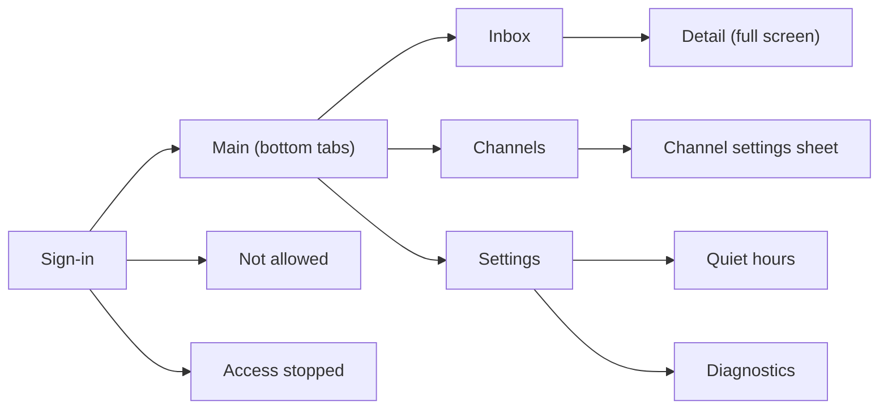

**English** | [한국어](ko/06_client-ux.md)

# Client UX

## 1. Purpose

This document defines the screens and wording of PushBeam for Android.

---

## 2. Principles

- Screens use white cards on a light gray background, an indigo accent, and color-coded icons per severity.
- All users have to do is install the app and sign in with Google. They never enter a server address or token.
- Settings are explained by their result, e.g. "Normal and low alerts won't ring; they stay in your list."
- Main screens avoid technical terms such as tokens or FCM.
- Severity is never shown by color alone; an icon and a label are always shown too.
- The app's language is Korean.

---

## 3. Screens

---

## 4. Sign-in

The app icon, the name "PushBeam", a one-line description, and a **Sign in with Google** button.

After signing in, the app asks for notification permission. If denied, a banner "Notifications are off [Open settings]" stays on the inbox.

**Not allowed** — shows the signed-in email, asks the user to give it to the operator, and offers **Sign in with another account**.

**Access stopped** — says the operator stopped access and that received alerts remain on the device, with **View inbox** (read-only) and **Sign in with another account**.

---

## 5. Inbox

- A large title, search and a menu (mark all read, clear all) at the top.
- Filter chips: **All**, **Unread** (with a red count badge), **Important** (high and critical), **Channel**.
- Alerts are grouped under **Today**, **Yesterday**, or a date, newest first.
- Each card shows:
  - a round icon — the severity icon for high/critical, otherwise the channel icon
  - "severity · channel" on the left and the relative time on the right
  - a bold title and up to two lines of body
  - a dot for unread alerts
- Alerts received during quiet hours show 🌙 "Received quietly".
- Alerts kept in the list only because of mute or minimum severity show 🔕 "Muted" or "Low severity".
- Tapping a card opens the detail screen and marks it as read.

### 5.1 Detail

A full screen with back and menu (delete), the severity icon and "severity · channel", a large title, the sent time, the body in a card, extra data, a channel info card, and **Share** / **Channel settings** buttons. Deleting removes the alert from this device only.

---

## 6. Channels

- Chips: **All n**, **Subscribed n**, **Not subscribed n**, plus search.
- Each card shows the channel icon, name (with a 🔒 for required channels), description, the subscriber count, and what rings (e.g. "High and above ring", "🔕 until 8:00 PM").
- A switch on the right subscribes or leaves. Required channels show the switch on and locked.
- Tapping a card opens a sheet:
  - Subscribe switch
  - **Ring for**: All / Normal and above / High and above / Critical only, with a one-line explanation
  - **Mute**: 1 hour / 8 hours / Until turned off, or **Unmute**
  - For required channels: "Critical alerts always ring."
- Changes are shown only after the server confirms them. On failure the previous value is restored with "Couldn't change it".
- Offline, everything is read-only with "You can change this when you're back online".

---

## 7. Settings

| Section       | Items                                                      |
| ------------- | ---------------------------------------------------------- |
| Account       | Email (tap to sign out)                                    |
| Notifications | Allow notifications, Vibration, Sound, Quiet hours, Per-severity sounds (system settings) |
| Device        | Battery optimization                                       |
| About         | Version, Diagnostics                                       |

- Vibration and Sound never affect critical alerts; the screen says so.
- **Quiet hours**: on/off, start and end time ("(next day)" when crossing midnight). "Alerts in this time arrive silently. Critical alerts in required channels still ring."
- **Diagnostics**: app version, account, last device registration, notification permission, battery optimization, server address, with a **Copy** button. Tokens are never shown.

---

## 8. System notifications

- Title and body as sent; the channel name as subtext.
- Long bodies can be expanded.
- Android notification channels per severity (critical, high, normal, low, quiet), plus vibrate-only, sound-only and silent channels for the Settings switches. Sounds the user changes in Android settings are never overwritten.
