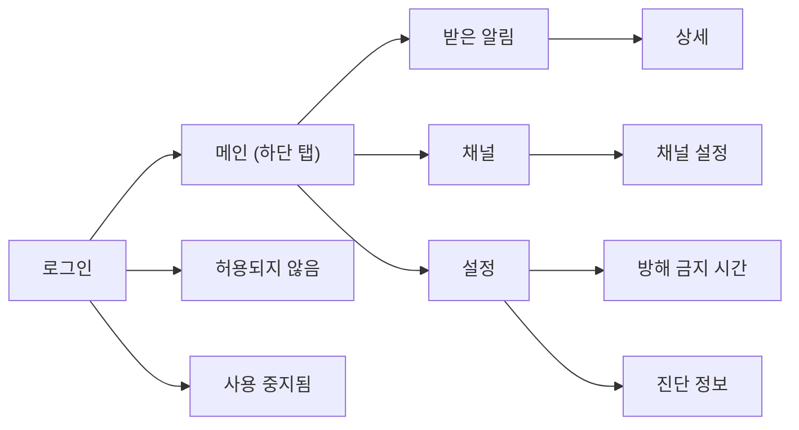

# Client UX

## 1. 문서 목적

이 문서는 PushBeam for Android의 화면과 문구를 정의한다.

---

## 2. 원칙

화면은 밝은 회색 배경 위 흰 카드, 인디고 강조색, 중요도별 색 아이콘을 쓴다.


- 사용자가 할 일은 설치하고 Google로 로그인하는 것뿐이다. 서버 주소나 토큰을 입력하지 않는다.
- 설정은 결과로 설명한다. 예: "보통·낮음 알림은 울리지 않고 목록에만 남아요."
- 기본 화면에 토큰, FCM 같은 기술 용어를 쓰지 않는다.
- 중요도는 색만으로 구분하지 않고 아이콘과 글자를 함께 쓴다.
- 기본 언어는 한국어다.

---

## 3. 화면 구성



---

## 4. 로그인

```text
PushBeam
운영자가 허용한 사람에게 서버 알림을 전해 주는 앱이에요.

[ Google 계정으로 로그인 ]
```

로그인에 성공하면 알림 권한을 요청한다. 거부하면 받은 알림 화면 위에 "알림 권한이 꺼져 있어요 [설정 열기]"를 계속 보여 준다.

**허용되지 않음**

```text
아직 PushBeam을 쓸 수 없어요.
alice@gmail.com 계정은 허용 목록에 없어요. 운영자에게 이 이메일을 알려 주세요.
[ 다른 계정으로 로그인 ]
```

**사용 중지됨**

```text
운영자가 이 계정의 사용을 중지했어요. 더 이상 알림을 받지 않아요.
받은 알림 기록은 이 기기에 남아 있어요.
[ 받은 알림 보기 ]  [ 다른 계정으로 로그인 ]
```

---

## 5. 받은 알림

```text
⛔ 긴급 · 서버 경고 · 2분 전                    ●
디스크 경고
nas-01 /var 사용량 92%
─────────────────────────────────────────────
🌙 보통 · 배포 · 03:12 · 조용히 받음
배포 완료
api-server v2.4.1
```

- 최신 알림이 위에 온다.
- 안 읽은 알림은 굵게, 점으로 표시한다.
- 방해 금지 시간에 받은 알림은 🌙 "조용히 받음"을 붙인다.
- 음소거나 최소 중요도 때문에 알림 없이 받은 알림은 🔕 "음소거됨" 또는 "중요도 낮음"을 붙인다.
- 위쪽 칩으로 걸러 본다: [안 읽음] [중요도] [채널]
- 메뉴: 모두 읽음, 모두 지우기. 하나 지우기는 상세에서 한다. 지우면 이 기기에서만 사라진다.
- 알림을 누르면 상세가 열리고 읽음 처리된다. 상세에는 본문 전체, 보낸 시각, 추가 데이터가 나온다.

---

## 6. 채널

```text
필수 채널
  서버 경고               🔒 해제할 수 없음 · 모두 받는 중

구독 중
  배포                    🔕 오후 8:00까지 음소거 · 높음 이상만

구독할 수 있는 채널
  백업                    [ 구독 ]
```

채널을 누르면 설정이 열린다.

```text
배포
api, web 배포 결과

구독                                   [ ● ]

받을 알림   ○ 모두  ○ 보통 이상  ● 높음 이상  ○ 긴급만

음소거      [ 1시간 ] [ 8시간 ] [ 직접 끌 때까지 ]
```

- 필수 채널은 구독 스위치를 끌 수 없고 "운영자가 정한 필수 채널이에요. 긴급 알림은 항상 와요."를 보여 준다.
- 변경은 서버가 성공을 알려 준 뒤에 반영한다. 실패하면 되돌리고 "변경하지 못했어요"를 보여 준다.
- 오프라인이면 읽기만 가능하고 "연결되면 바꿀 수 있어요"를 보여 준다.

---

## 7. 설정

```text
계정          alice@gmail.com            [ 로그아웃 ]
알림 권한     허용됨
알림 소리     중요도별 설정 열기 ▸
방해 금지     오후 11:00 ~ 오전 7:00 ▸
진단 정보     ▸
앱 버전       0.2.0
```

**방해 금지 시간**

```text
방해 금지 시간                         [ ● ]
시작  오후 11:00    종료  오전 7:00 (다음 날)

이 시간에 온 알림은 소리 없이 목록에만 남아요.
필수 채널의 긴급 알림은 소리가 나요.
```

**진단 정보**: 앱 버전, 로그인 계정, 마지막 기기 등록 시각, 알림 권한, 배터리 최적화 상태. [복사] 버튼. 토큰 원문은 보여 주지 않는다.

---

## 8. 시스템 알림

- 제목과 본문을 그대로 쓰고, 보조 글자에 채널 이름을 쓴다.
- 긴 본문은 펼쳐 볼 수 있다.
- 중요도별 Android 알림 채널(긴급, 높음, 보통, 낮음, 조용히)을 쓴다. 사용자가 Android 설정에서 바꾼 소리는 앱이 덮어쓰지 않는다.
