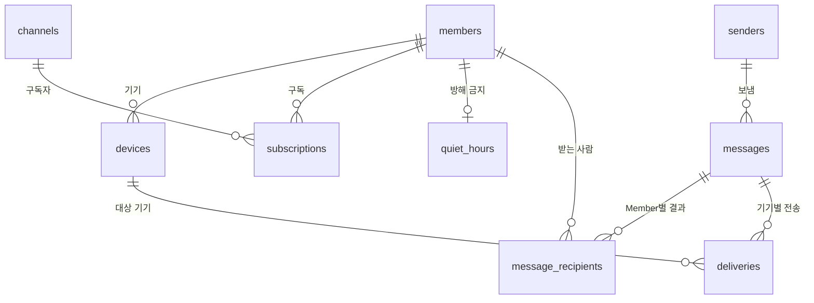

[English](../02_data-model.md) | **한국어**

# Data Model

## 1. 문서 목적

이 문서는 PushBeam Server의 DB 테이블과 Android 앱의 로컬 저장소를 정의한다.

---

## 2. 기본 규칙

- DB는 SQLite 파일 하나다: `/data/pushbeam.db`
- Schema 변경은 `server/src/main/resources/db/migration/`의 번호 붙은 SQL 파일(`V1__init.sql`, `V2__…`)로만 한다. 서버가 시작할 때 아직 적용하지 않은 파일을 순서대로 적용하고 `schema_version`에 기록한다. 이미 적용한 파일은 고치지 않는다.
- 시각은 UTC epoch milliseconds로 저장한다.
- ID는 접두어 + ULID다: `mbr_`, `dev_`, `snd_`, `msg_`, `dlv_`
- 이메일은 소문자로 저장한다.
- 중요도는 `CRITICAL > HIGH > NORMAL > LOW` 순서다.

---

## 3. 테이블 관계



---

## 4. 설정 테이블

### 4.1 members

```sql
CREATE TABLE members (
  id            TEXT PRIMARY KEY,
  email         TEXT NOT NULL UNIQUE,
  display_name  TEXT,
  status        TEXT NOT NULL,          -- INVITED, ACTIVE, REVOKED
  time_zone     TEXT,                   -- 마지막으로 등록한 기기의 시간대
  allowed_at    INTEGER NOT NULL,
  activated_at  INTEGER,
  revoked_at    INTEGER,
  last_seen_at  INTEGER
);
```

### 4.2 devices

```sql
CREATE TABLE devices (
  id               TEXT PRIMARY KEY,
  member_id        TEXT NOT NULL REFERENCES members(id),
  installation_id  TEXT NOT NULL UNIQUE,
  fcm_token        TEXT NOT NULL,
  active           INTEGER NOT NULL,     -- 1이면 발송 대상
  model            TEXT,
  app_version      INTEGER,
  registered_at    INTEGER NOT NULL,
  last_seen_at     INTEGER NOT NULL
);

CREATE UNIQUE INDEX devices_active_token ON devices(fcm_token) WHERE active = 1;
```

- 같은 Installation ID로 다시 등록하면 토큰을 갱신하고 활성화한다.
- 다른 Member가 같은 Installation ID로 등록하면 기기의 주인을 바꾼다.
- 같은 FCM 토큰을 가진 다른 기기가 있으면 그 기기를 비활성화한다.
- FCM이 토큰 무효라고 하면, 로그아웃하면, Member가 취소되면 비활성화한다.

### 4.3 channels

```sql
CREATE TABLE channels (
  slug            TEXT PRIMARY KEY,     -- ^[a-z0-9-]{3,40}$
  name            TEXT NOT NULL,
  description     TEXT,
  required        INTEGER NOT NULL,
  auto_subscribe  INTEGER NOT NULL,
  created_at      INTEGER NOT NULL,
  archived_at     INTEGER              -- 보관되면 보이지 않고 발송 불가
);
```

채널은 지우지 않고 보관한다. slug는 바꿀 수 없다.

### 4.4 subscriptions

```sql
CREATE TABLE subscriptions (
  member_id     TEXT NOT NULL REFERENCES members(id),
  channel       TEXT NOT NULL REFERENCES channels(slug),
  min_severity  TEXT NOT NULL DEFAULT 'LOW',
  muted         INTEGER NOT NULL DEFAULT 0,
  muted_until   INTEGER,                -- muted = 1이고 NULL이면 직접 끌 때까지
  created_at    INTEGER NOT NULL,
  PRIMARY KEY (member_id, channel)
);
```

음소거 중인 조건: `muted = 1` 그리고 (`muted_until`이 NULL 또는 지금보다 미래)

구독이 만들어지는 때:

- Member가 처음 로그인할 때: 필수 채널과 자동 구독 채널
- 필수 채널이 새로 생기거나 기존 채널이 필수로 바뀔 때: 모든 `ACTIVE` Member
- Member가 직접 구독할 때
- 운영자가 구독시킬 때

### 4.5 quiet_hours

```sql
CREATE TABLE quiet_hours (
  member_id  TEXT PRIMARY KEY REFERENCES members(id),
  enabled    INTEGER NOT NULL,
  start_min  INTEGER NOT NULL,          -- 자정부터 분 (0~1439)
  end_min    INTEGER NOT NULL
);
```

`start_min > end_min`이면 자정을 넘는 구간이다. 같으면 꺼진 것으로 본다.

### 4.6 senders

```sql
CREATE TABLE senders (
  id                TEXT PRIMARY KEY,
  name              TEXT NOT NULL UNIQUE,
  key_hash          TEXT NOT NULL UNIQUE,   -- Sender Key의 SHA-256
  allowed_channels  TEXT NOT NULL,          -- JSON 배열
  created_at        INTEGER NOT NULL,
  last_used_at      INTEGER,
  revoked_at        INTEGER
);
```

---

## 5. 기록 테이블

### 5.1 messages

```sql
CREATE TABLE messages (
  id              TEXT PRIMARY KEY,
  sender_id       TEXT REFERENCES senders(id),   -- NULL이면 Operator
  target_type     TEXT NOT NULL,                 -- CHANNEL, USERS, ALL
  target_channel  TEXT,
  target_emails   TEXT,                          -- USERS일 때 JSON 배열
  title           TEXT NOT NULL,
  body            TEXT NOT NULL,
  severity        TEXT NOT NULL,
  data            TEXT,                          -- JSON 객체
  created_at      INTEGER NOT NULL
);
```

### 5.2 message_recipients

Member별로 보냈는지, 안 보냈다면 왜인지 기록한다.

```sql
CREATE TABLE message_recipients (
  message_id  TEXT NOT NULL REFERENCES messages(id) ON DELETE CASCADE,
  member_id   TEXT NOT NULL REFERENCES members(id),
  result      TEXT NOT NULL,
  PRIMARY KEY (message_id, member_id)
);
```

| result       | 의미                                   |
| ------------ | -------------------------------------- |
| `DELIVER`    | 보냄                                   |
| `QUIET`      | 방해 금지 시간이라 무음으로 보냄       |
| `MUTED`      | 음소거라 알림 없이 목록만 보냄         |
| `BELOW_MIN`  | 최소 중요도보다 낮아 알림 없이 목록만 보냄 |
| `NOT_ACTIVE` | 아직 로그인 안 함                      |
| `NO_DEVICE`  | 활성 기기가 없음                       |

채널 알림에서 구독하지 않은 Member는 기록하지 않는다.

### 5.3 deliveries

기기마다 FCM 전송 1건이다.

```sql
CREATE TABLE deliveries (
  id               TEXT PRIMARY KEY,
  message_id       TEXT NOT NULL REFERENCES messages(id) ON DELETE CASCADE,
  device_id        TEXT NOT NULL REFERENCES devices(id),
  quiet            INTEGER NOT NULL,     -- display = QUIET와 같다 (V1 호환)
  display          TEXT NOT NULL,        -- NORMAL(알림), QUIET(소리 없음), INBOX(알림 없이 목록만)
  reason           TEXT,                 -- INBOX인 이유: muted, below_min
  status           TEXT NOT NULL,     -- PENDING, SENT, FAILED, INVALID_TOKEN, CANCELLED
  attempts         INTEGER NOT NULL DEFAULT 0,
  next_attempt_at  INTEGER,
  last_error       TEXT,
  updated_at       INTEGER NOT NULL
);

CREATE INDEX deliveries_pending ON deliveries(next_attempt_at) WHERE status = 'PENDING';
```

---

## 6. 보관

| 데이터                                  | 보관                            |
| --------------------------------------- | ------------------------------- |
| messages, message_recipients, deliveries | 90일                           |
| members, channels, senders, devices     | 지우지 않음 (취소·폐기·비활성 상태로 남음) |

---

## 7. Android 로컬 저장소

### 7.1 Inbox (Room)

```sql
CREATE TABLE inbox (
  message_id   TEXT PRIMARY KEY NOT NULL,
  title        TEXT NOT NULL,
  body         TEXT NOT NULL,
  severity     TEXT NOT NULL,
  channel      TEXT,
  quiet        INTEGER NOT NULL,
  display      TEXT NOT NULL,   -- normal, quiet, inbox
  reason       TEXT,
  data         TEXT,
  sent_at      INTEGER NOT NULL,
  received_at  INTEGER NOT NULL,
  read_at      INTEGER
);
```

`INSERT OR IGNORE`로 저장하고, 새로 저장된 경우에만 알림을 띄운다. 이것이 중복 제거다.

90일이 지난 항목은 지운다. 다른 계정으로 로그인하면 비운다.

### 7.2 DataStore

| 값                    | 용도                                  |
| --------------------- | ------------------------------------- |
| `installationId`      | 기기 식별자                           |
| `needsRegistration`   | 기기 등록을 다시 해야 하는지          |
| `lastRegisteredAt`    | 마지막 등록 시각                      |
| `lastAppVersion`      | 업데이트 감지                         |
| 채널·설정 캐시        | 오프라인일 때 화면 표시용             |

앱 저장소는 Android 자동 백업에서 제외한다.
