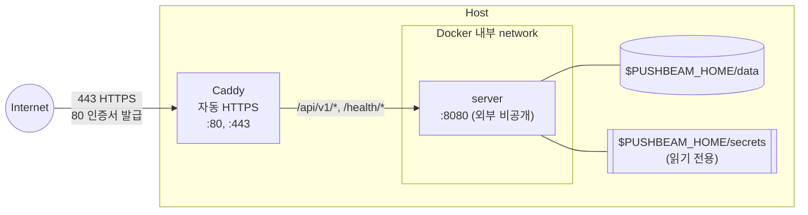

[English](../04_security-and-deployment.md) | **한국어**

# Security and Deployment

## 1. 문서 목적

이 문서는 PushBeam의 배포 구성과 인증, 비밀 값 관리를 정의한다.

---

## 2. 배포 구성

어떤 방식이든 다음을 지킨다.

- 서버는 HTTPS 뒤에 둔다. 서버의 8080은 외부에 직접 열지 않는다.
- 외부에는 `/api/v1/*`만 공개한다. `/health/*`는 내부 확인용이다.
- 서버는 하나만 실행한다 (SQLite 파일 하나).
- 데이터 디렉터리는 로컬 디스크에 둔다. NFS 같은 네트워크 디스크는 SQLite에 쓰지 않는다.
- 서버는 root가 아닌 사용자로 실행한다.
- 서버는 FCM과 Firebase API로 나가는 HTTPS 연결이 필요하다.
- 앱은 HTTPS만 사용한다.

저장소에는 누구나 쓸 수 있는 구성만 둔다. 도메인, Firebase 프로젝트, 비밀 값, 클러스터 설정은 git이 무시하는 파일(`deploy/compose/.env`, `deploy/kubernetes/overlays/*-local/`)이나 저장소 밖에 둔다.

### 2.1 Docker Compose (서버 한 대)

`deploy/compose/`에 있다. Caddy가 Let's Encrypt 인증서를 받아 HTTPS를 처리한다.



```bash
cd deploy/compose
cp .env.example .env    # 도메인, PUSHBEAM_HOME, Firebase 프로젝트 번호
# $PUSHBEAM_HOME/secrets/에 firebase-service-account.json, operator-token을 둔다
docker compose up -d --build
```

### 2.2 Kubernetes

`deploy/kubernetes/base/`에 Deployment, Service, PVC가 있다. 네임스페이스, 이미지, 저장소, 실행 UID, 외부 공개(Gateway/Ingress), NetworkPolicy는 클러스터마다 overlay로 정한다. 자세한 내용은 [deploy/kubernetes/README.md](../../deploy/kubernetes/README.ko.md)를 따른다.

ConfigMap `pushbeam-config`(`firebase-project-number`)와 Secret `pushbeam-secrets`(`firebase-service-account.json`, `operator-token`)는 저장소에 넣지 않고 `kubectl`로 만든다.

---

## 3. 인증

| 주체     | 자격 증명            | 서버 확인 방법                                  |
| -------- | -------------------- | ----------------------------------------------- |
| Operator | Operator Token       | Secret의 `operator-token` 값과 비교             |
| Sender   | Sender Key (`pbs_…`) | SHA-256 hash로 `senders` 조회, 폐기 여부 확인   |
| Member   | Firebase ID Token    | Firebase Admin SDK로 검증 → 이메일이 허용 목록에 있고 `REVOKED`가 아닌지 확인 |

- Operator Token과 Sender Key는 32 byte 이상의 무작위 값이다.
- Sender Key는 발급할 때 한 번만 보여 준다.
- Member는 Google 로그인만 허용하고, 이메일이 인증된(`email_verified`) 토큰만 받는다.
- Member API는 경로에 다른 사람을 지정할 수 없다. 대상은 항상 토큰의 이메일이다.

### 3.1 권한

| 동작                                 | Operator | Sender           | Member   |
| ------------------------------------ | -------- | ---------------- | -------- |
| 채널 발송                            | 모든 채널 | 허용된 채널만    | 불가     |
| 사용자·전체 발송                     | 가능     | 불가             | 불가     |
| 허용, 채널, Sender 관리, 기록 조회   | 가능     | 불가             | 불가     |
| 내 기기, 구독, 방해 금지 설정        | 불가     | 불가             | 본인만   |

---

## 4. Firebase 서비스 계정

서버와 CI는 서비스 계정을 따로 쓴다.

| 계정              | 사용처          | 역할                                                   |
| ----------------- | --------------- | ------------------------------------------------------ |
| `pushbeam-server` | 서버            | Firebase Cloud Messaging API Admin, Firebase App Distribution Admin |
| `pushbeam-ci`     | GitHub Actions  | Firebase App Distribution Admin                        |

---

## 5. 비밀 값

| 비밀 값                     | 보관 위치                                       |
| --------------------------- | ----------------------------------------------- |
| Firebase 서버 계정 키       | Host `secrets/`                                 |
| Operator Token              | Host `secrets/`, 운영자의 PushBeam Admin 설정    |
| Sender Key                  | Sender가 실행되는 곳 (서버에는 hash만)          |
| 앱 서명 키                  | 저장소 밖, 별도 백업, GitHub Secret             |
| CI 서비스 계정 키           | GitHub Secret                                   |

- 비밀 값은 Git 저장소, Docker 이미지, DB 백업, 로그에 넣지 않는다.
- 로그에는 Authorization header, 토큰, FCM 토큰, 알림 제목·본문을 남기지 않는다. ID로만 남긴다.
- 앱 서명 키를 잃으면 모든 Member가 앱을 지우고 다시 설치해야 한다. 꼭 백업한다.

---

## 6. CI

GitHub Actions는 저장소 설정(Settings → Secrets and variables → Actions)에서 값을 읽는다.

| 종류     | 이름                          | 용도                                            |
| -------- | ----------------------------- | ----------------------------------------------- |
| Variable | `FIREBASE_APP_ID`             | App Distribution에 올릴 Firebase Android 앱 ID  |
| Variable | `PUSHBEAM_URL`                | 앱이 접속할 서버 주소 (`https://…`)             |
| Variable | `FIREBASE_TESTER_GROUP`       | 배포할 테스터 그룹. 없으면 `pushbeam-members`   |
| Secret   | `GOOGLE_SERVICES_JSON`        | Firebase 앱 설정 파일 내용                      |
| Secret   | `FIREBASE_SERVICE_ACCOUNT`    | App Distribution 업로드용 서비스 계정 키        |
| Secret   | `ANDROID_KEYSTORE_BASE64`     | 앱 서명 키                                      |
| Secret   | `ANDROID_KEYSTORE_PASSWORD`   |                                                 |
| Secret   | `ANDROID_KEY_ALIAS`           |                                                 |
| Secret   | `ANDROID_KEY_PASSWORD`        |                                                 |

- `GOOGLE_SERVICES_JSON`이 없으면 CI는 `android/google-services.example.json`으로 컴파일만 확인한다.
- 앱은 테스터 그룹으로 배포한다. CI는 테스터 이메일을 알지 못한다.
- `versionCode`는 CI 실행 번호 + 100이다. 수동으로 올린 빌드는 100보다 작은 번호를 쓴다.
