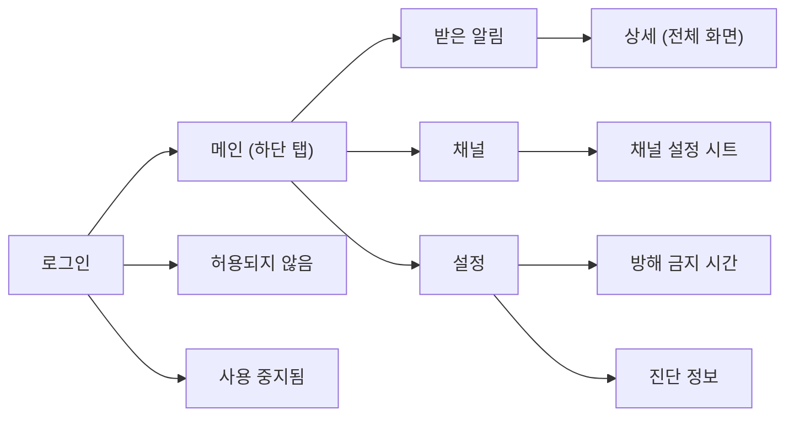

[English](../06_client-ux.md) | **한국어**

# Client UX

## 1. 문서 목적

이 문서는 PushBeam for Android의 화면과 문구를 정의한다.

---

## 2. 원칙

- 화면은 밝은 회색 배경 위 흰 카드, 인디고 강조색, 중요도별 색 아이콘을 쓴다.
- 사용자가 할 일은 설치하고 Google로 로그인하는 것뿐이다. 서버 주소나 토큰을 입력하지 않는다.
- 설정은 결과로 설명한다. 예: "일반·낮음 알림은 울리지 않고 목록에만 남아요."
- 기본 화면에 토큰, FCM 같은 기술 용어를 쓰지 않는다.
- 중요도는 색만으로 구분하지 않고 아이콘과 글자를 함께 쓴다.
- 앱의 언어는 한국어다.

---

## 3. 화면 구성

---

## 4. 로그인

앱 아이콘, "PushBeam", 한 줄 설명, **Google 계정으로 로그인** 버튼.

로그인하면 알림 권한을 요청한다. 거부하면 받은 알림 화면 위에 "알림 권한이 꺼져 있어요 [설정 열기]"를 계속 보여 준다.

**허용되지 않음**: 로그인한 이메일을 보여 주고 운영자에게 알려 달라고 안내한다. **다른 계정으로 로그인** 버튼.

**사용 중지됨**: 운영자가 사용을 중지했고 받은 알림은 기기에 남아 있다고 안내한다. **받은 알림 보기**(읽기 전용), **다른 계정으로 로그인** 버튼.

---

## 5. 받은 알림

- 위쪽: 큰 제목, 검색, 메뉴(모두 읽음, 모두 지우기)
- 칩: **전체**, **안 읽음**(빨간 개수 배지), **중요**(높음·긴급), **채널**
- 최신순으로 **오늘**, **어제**, 날짜별로 묶는다.
- 카드:
  - 원형 아이콘: 높음·긴급은 중요도 아이콘, 그 외는 채널 아이콘
  - 왼쪽에 "중요도 · 채널", 오른쪽 끝에 상대 시간
  - 굵은 제목과 두 줄까지의 본문
  - 안 읽은 알림은 점으로 표시
- 방해 금지 시간에 받은 알림은 🌙 "조용히 받음"을 붙인다.
- 음소거나 최소 중요도 때문에 알림 없이 받은 알림은 🔕 "음소거됨" 또는 "중요도 낮음"을 붙인다.
- 카드를 누르면 상세가 열리고 읽음 처리된다.

### 5.1 상세

전체 화면. 뒤로·메뉴(지우기), 중요도 아이콘과 "중요도 · 채널", 큰 제목, 보낸 시각, 본문 카드, 추가 정보, 채널 정보 카드, **공유** / **채널 설정** 버튼. 지우면 이 기기에서만 사라진다.

---

## 6. 채널

- 칩: **전체 n**, **구독 중 n**, **미구독 n**, 검색
- 카드: 채널 아이콘, 이름(필수 채널은 🔒), 설명, 구독자 수, 울리는 범위(예: "높음 이상 울림", "🔕 오후 8:00까지")
- 오른쪽 스위치로 구독·해제한다. 필수 채널은 켜진 채 잠겨 있다.
- 카드를 누르면 설정 시트가 열린다.
  - 구독 스위치
  - **울릴 알림**: 모두 / 일반 이상 / 높음 이상 / 긴급만, 한 줄 설명
  - **음소거**: 1시간 / 8시간 / 직접 끌 때까지, 또는 **해제**
  - 필수 채널이면 "긴급 알림은 항상 울려요."
- 변경은 서버가 성공을 알려 준 뒤에 반영한다. 실패하면 되돌리고 "변경하지 못했어요"를 보여 준다.
- 오프라인이면 읽기만 가능하고 "연결되면 바꿀 수 있어요"를 보여 준다.

---

## 7. 설정

| 구역      | 항목                                                       |
| --------- | ---------------------------------------------------------- |
| 계정      | 이메일 (누르면 로그아웃)                                   |
| 알림 설정 | 알림 허용, 진동, 소리, 방해 금지 시간, 중요도별 알림 소리(시스템 설정) |
| 기기      | 배터리 최적화                                              |
| 앱 정보   | 버전, 진단 정보                                            |

- 진동·소리 설정은 긴급 알림에 적용하지 않고, 화면에 그렇게 안내한다.
- **방해 금지 시간**: 켜기·끄기, 시작·종료 시각(자정을 넘으면 "(다음 날)"). "이 시간에 온 알림은 소리 없이 받아요. 필수 채널의 긴급 알림은 소리가 나요."
- **진단 정보**: 앱 버전, 로그인 계정, 마지막 기기 등록 시각, 알림 권한, 배터리 최적화, 서버 주소, [복사] 버튼. 토큰 원문은 보여 주지 않는다.

---

## 8. 시스템 알림

- 제목과 본문을 그대로 쓰고, 보조 글자에 채널 이름을 쓴다.
- 긴 본문은 펼쳐 볼 수 있다.
- 중요도별 Android 알림 채널(긴급, 높음, 일반, 낮음, 조용히)과, 설정의 진동·소리 스위치용 채널(진동만, 소리만, 무음)을 쓴다. 사용자가 Android 설정에서 바꾼 소리는 앱이 덮어쓰지 않는다.
